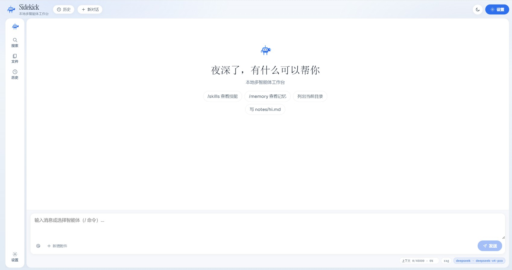
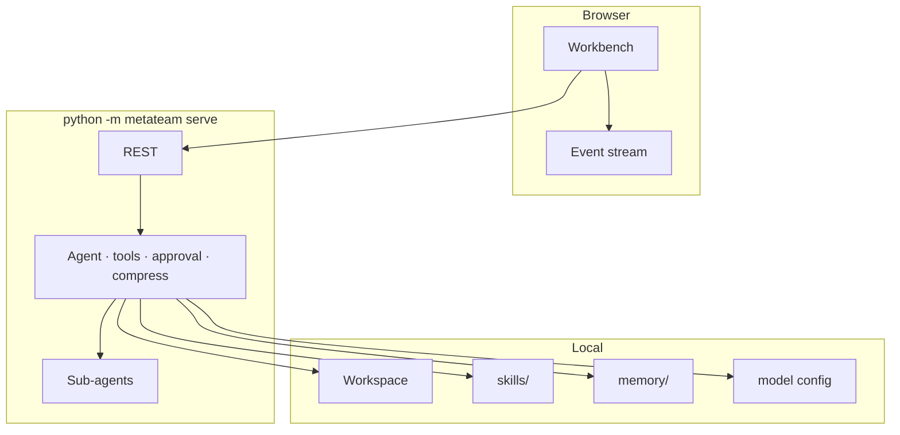

# Sidekick

[中文](README.md) · English

**Sidekick** is an open-source **local multi-agent AI workspace** you run on your own machine.
Open a folder, chat in the browser, and let a main agent plus sub-agents search and edit files — with human approval, Skills you can drop in, and Memory that sticks.

Built to be **forked**: clear Python + Vite layers, add a Skill or tool without fighting a black box.
Built to be **cheap to run**: context compression, on-demand Skills, and separate main / sub / compress models so the same work burns far fewer tokens.

**Windows · macOS · Linux** · default **http://127.0.0.1:8787**

---

## Screenshots




---

## Why Sidekick

**Fork-friendly**  
FastAPI backend + Vite frontend. API, agent runtime, tools, Skills, and Memory are separate layers — ship a private fork by dropping Skills or registering tools.

**Token-efficient**  
Compress when the context fills (capped rounds). Skills are callable tools, not giant prompts pasted every turn. Point heavy work at a strong model and delegation / compression at cheaper ones.

**Workspace-native**  
Content search, streaming chat, and a detail panel in one UI. Mutating actions (write, delete, shell, memory) ask for approval first.

**Yours**  
Runs locally. Bring your own API key. History, Memory, and workspace stay on disk you control.

---

## Capabilities

| | |
|---|---|
| **Chat + tools** | SSE streaming, attachments, stop cleanly, edit & resend (optionally restore files to that step) |
| **Files** | Create / rename / delete (confirm) / drag-move; search by name **and** content with line jump |
| **Memory** | Append, remove, or rewrite `MEMORY.md` (approval required) |
| **Skills** | Drop packs under `backend/skills/`, invoke with `/skill <name>` |
| **Models** | Separate main, sub-agent, and compress models |
| **UI** | Chinese / English · light / dark · paginated history |

### Slash commands

`/help` · `/new` · `/clear` · `/skills` · `/skill <name>` · `/memory` · `/history` · `/stop`

---

## Quick start

**Requirements:** Python 3.10+ · Node.js 18+ (frontend only)

### Windows PowerShell

```powershell
cd path\to\Sidekick
python -m pip install -r backend\requirements.txt
$env:PYTHONPATH = "$PWD\backend"
python -m metateam serve
```

### macOS / Linux

```bash
cd /path/to/Sidekick
python3 -m pip install -r backend/requirements.txt
export PYTHONPATH="$PWD/backend"
python3 -m metateam serve
```

Open **http://127.0.0.1:8787** → pick a workspace folder → Settings → Model → API key  
(or copy `backend/data/model.json.example` → `model.json`).

> Never commit real keys, `.env`, or chat history (see `.gitignore`).

### Frontend (optional)

```powershell
cd frontend
npm i
npm run dev          # HMR
# npm run build      # then backend-only
```

---

## Architecture



```
Sidekick/
├── backend/metateam/     # server, agents, tools
├── backend/skills/       # drop-in Skills
├── backend/memory/       # MEMORY.md
├── backend/data/         # model.json.example (no secrets)
├── frontend/             # Vite UI
├── docs/screenshots/
├── README.md
└── README.en.md
```
