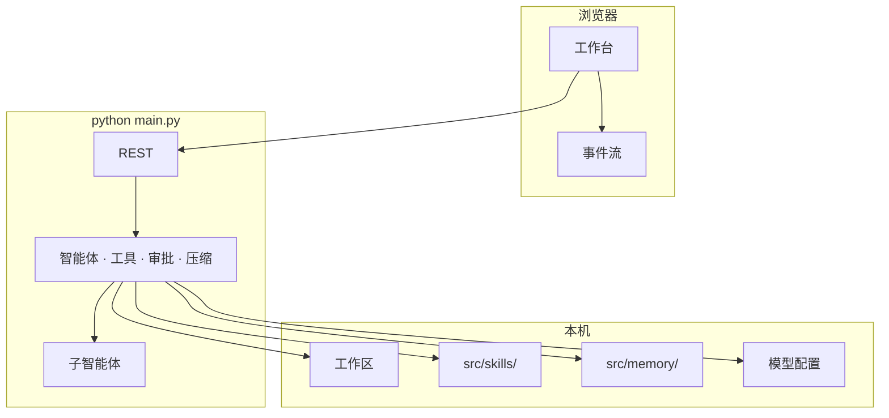

# Sidekick

[English](README.en.md) · 中文

**Sidekick** 是开源的**本机多智能体 AI 工作台**。
打开本机文件夹，在浏览器里对话，由主智能体与子智能体协作搜索、编辑文件——变更需你确认，Skills 可直接丢进目录，Memory 可长期记住。

为**二开**而设计：Python + Vite 分层清楚，加 Skill 或注册工具就能私有化，不用硬啃黑盒。
为**省 Token**而设计：上下文压缩、Skills 按需调用、主 / 子 / 压缩模型可拆开配——同样干活，计费轻一截。

**Windows · macOS · Linux** · 默认 **http://127.0.0.1:8787**

---

## 界面预览


---

## 为什么是 Sidekick

**方便二开**  
`src/` 核心运行时 + `ui/` 控制界面（布局参考 OpenClaw）。API、智能体、工具、Skills、Memory 分层独立——丢一个 Skill 目录或注册一条工具，就能做出自己的私有版。

**Token 更省**  
上下文将满时自动压缩（有轮次上限）。Skills 是按需调用的工具，不是每轮把长流程塞进 prompt。重活用强模型，委派与压缩用便宜模型。

**贴着工作区干活**  
内容搜索、流式对话、详情面板一体。写入 / 删除 / Shell / 记忆变更先征求批准。

**数据在你这边**  
本机运行，自备 API Key。历史、Memory、工作区文件都在你控制的磁盘上。

---

## 能力一览

| | |
|---|---|
| **对话 + 工具** | SSE 流式、附件、干净停止、编辑重发（可选恢复文件到该步） |
| **文件** | 新建 / 重命名 / 删除确认 / 拖拽移动；按文件名**与**内容搜索并跳行 |
| **浏览器沙盒** | CDP/Playwright Chromium：预览本地站、Select Mode 点选 DOM 发给 Agent；Agent 可用 browser_* 工具验收 |
| **Memory** | 追加、删除或覆写 `MEMORY.md`（需确认） |
| **Skills** | 放到 `src/skills/`，`/skill <名称>` 调用 |
| **模型** | 主模型 / 子模型 / 压缩模型可分开配置 |
| **界面** | 中 / 英 · 浅 / 暗色 · 历史分页 |

### 斜杠命令

`/help` · `/new` · `/clear` · `/skills` · `/skill <名称>` · `/memory` · `/history` · `/browser` · `/stop`

浏览器沙盒依赖 Playwright Chromium（一次性）：

```bash
pip install playwright
playwright install chromium
```

详见 [docs/browser-sandbox.md](docs/browser-sandbox.md)。

---

## 快速开始

**环境：** Python 3.10+ · Node.js 18+（仅 UI 需要）

### Windows PowerShell

```powershell
cd path\to\Sidekick
python -m pip install -r requirements.txt
python main.py
```

或双击 **`start.bat`**（无需设置 `PYTHONPATH`）。

### macOS / Linux

```bash
cd /path/to/Sidekick
python3 -m pip install -r requirements.txt
python3 main.py
```

打开 **http://127.0.0.1:8787** → 选工作区文件夹 → 设置 → 模型 → API Key  
（或复制 `src/data/model.json.example` → `src/data/model.json`）

### 桌面应用（对齐 Cursor：实时内嵌预览）

推荐日常用桌面壳——侧栏浏览器是 **Electron BrowserView 实时页面**（可点选、滚动、HMR），不是截图。

双击 **`start-desktop.bat`** 会自动：

1. `pip install -r requirements.txt`（含 Playwright）
2. 如缺则 `playwright install chromium`（Agent 浏览器工具）
3. 安装 `desktop/` / `ui/` 的 npm 依赖并构建 UI
4. 启动 Electron（后端缺省时自动拉起）

```powershell
.\start-desktop.bat
```

也可设置解释器：`set SIDEKICK_PYTHON=C:\path\to\python.exe`，或写入 `.sidekick-python`。

打开侧栏「浏览器」，或对话里 **Ctrl+点击**本地链接 →「在沙盒打开」。本地预览请优先用 `http://localhost:端口`（Windows 上 Vite 常只监听 IPv6，`127.0.0.1` 可能连不上）。

详见 [desktop/README.md](desktop/README.md) · [docs/browser-sandbox.md](docs/browser-sandbox.md)。

> 切勿提交真实 Key、`.env`、会话或 `model.json`（见 `.gitignore`）。

### 本机安全（默认）

- 仅绑定 `127.0.0.1`；非本机绑定需显式 `META_ALLOW_REMOTE=1`（不安全）。
- API 需本地令牌（`X-Sidekick-Token`，启动时写入 `src/data/.local_token`）；UI 经 `/api/bootstrap` 自动获取。
- `model.json` 中的 API Key 使用本机密钥加密存储（`src/data/.secret_key`）。
- Shell 工具默认开启（`META_ALLOW_SHELL=1`），仍走 Agent 审批门；设为 `0` 可完全关闭。
- **审批边界**：ApprovalGate 约束 Agent 工具调用；UI 直接写文件走本机令牌 + 前端确认框。

### UI（可选）

```powershell
cd ui
npm i
npm run dev          # 热更新
# npm run build      # 构建后只跑后端即可托管静态页
```

---

## 架构



```
Sidekick/
├── src/metateam/     # 核心：API、智能体、工具
├── src/skills/       # 可丢入的 Skills
├── src/memory/       # MEMORY.md
├── src/data/         # model.json.example（无密钥）
├── src/sessions/     # 会话（本地，不提交）
├── src/workspace/    # 默认工作区占位
├── ui/               # Vite 控制界面
├── desktop/          # Electron 桌面壳（实时内嵌浏览器）
├── docs/
├── main.py
├── start-desktop.bat # 一键装依赖并启动桌面端
├── requirements.txt
├── README.md
└── README.en.md
```
